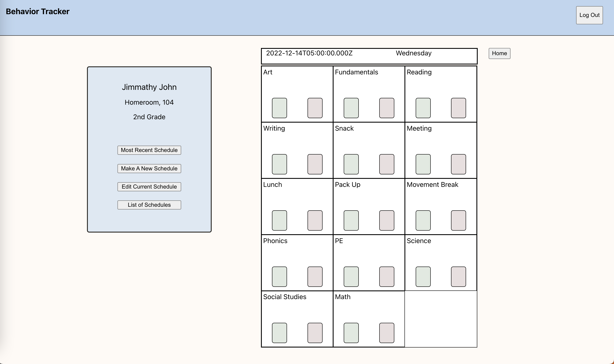

# 
 Behavior Tracker 

### 
 Easily keep track of your students and their behavior plans! 

#

### Date: 12/14/2022

#### &nbsp; &nbsp; &nbsp; &nbsp;Max Calabro | [LinkedIn](https://www.linkedin.com/in/max-calabro) | [GitHub](https://github.com/max-calabro)

---

### **_Description_**

#### This online tool is meant to replace the paper based system that many school counselors are still using. Using Bahavior Tracker you can easily keep your students info, and yourself, organized.

#### The biggest advantage of using this tool is the data aggregation. Over time you can view behavior trends of your students to better assist them throughout the year.

---

### 
**_Technologies Used_**

## 

### **_Getting Started_**

#### A Trello board was used to track development and can be viewed [here](https://trello.com/b/PdztvYgl/behavior-tracker).

---

## 

### **_Future Updates_**

- [ ] Print and Download options for the Schedules
- [ ] Trends Page
- [ ] How-to-use Page

---

### **_Credits_**

##### General Assembly: [Choose Your Path](https://generalassemb.ly/),

##### And my wonderful girlfriend for the idea.

---
